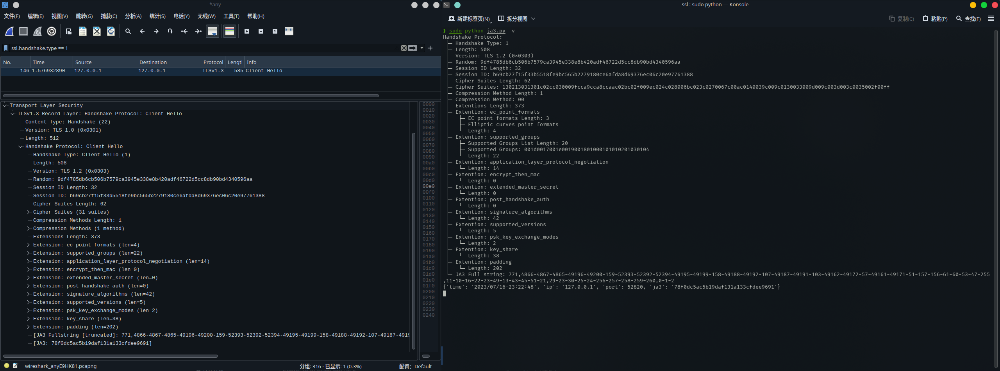

# JA3 Server
一个可获取JA3指纹的简易python服务端

## 使用方法

- 无参数默认监听127.0.0.1:443，不开启log

  ```sh
  python ja3-simple-server.py
  ```

- 指定监听地址

  ```sh
  python ja3-simple-server.py -l 0.0.0.0:8443
  ```

- 开启log

  ```sh
  python ja3-simple-server.py -l 0.0.0.0:8443 -v
  ```

 


